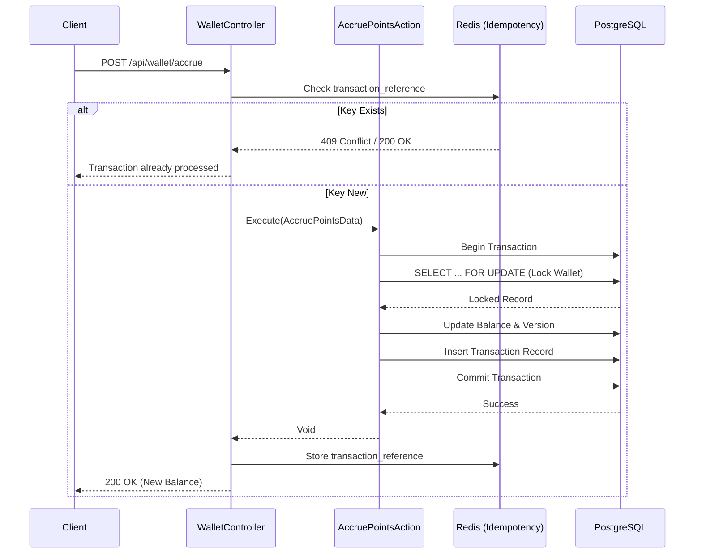

# LoyaltyHub


[](https://github.com/web-inwall/loyalty-hub/actions)
[](https://php.net)
[](https://laravel.com)
[](https://www.postgresql.org/)
[](https://redis.io/)
[](https://www.php-fig.org/psr/psr-12/)
[](https://github.com/larastan/larastan)

**High-performance Loyalty & Bonus Processing API.**

LoyaltyHub is an enterprise-grade modular monolith designed to handle high-concurrency wallet operations, bonus accruals, and transaction consistency with zero race conditions. Built with robust Domain-Driven Design (DDD) principles.

---

## 🚀 Key Features

*   🛡️ **Race Condition Protection**
    Utilizes pessimistic DB locking (`lockForUpdate`) within critical transaction boundaries to ensure that concurrent balance updates are processed sequentially.

*   ⚡ **Optimistic Locking**
    Implements version-based concurrency control (`HasOptimisticLocking` trait). Any attempt to save a stale model version will be rejected, preventing "lost update" anomalies.

*   🔄 **Idempotency**
    Guarantees reliable transaction processing. Duplicate requests with the same `transaction_reference` are detected and handled gracefully (returning the original response or a conflict status) without duplicating side effects.

*   🏗️ **Modular Monolith**
    Architected using **Domain-Driven Design (DDD)**. The codebase is organized into distinct domains (`app/Domains/Loyalty`, `app/Domains/Wallet`) to ensure separation of concerns and maintainability.

*   📊 **Event Sourcing Lite**
    maintains a complete, immutable audit log of all balance changes via the `transactions` table, linked to specific operation types and metadata.

---

## 🛠 Tech Stack

| Component | Technology | Description |
| :--- | :--- | :--- |
| **Framework** |  | Core application framework. |
| **Language** |  | Typed, modern PHP with Enums and Readonly classes. |
| **Database** |  | Primary data store for wallets and transactions. |
| **Cache** |  | High-speed caching for idempotency keys. |
| **Testing** |  | Elegant testing framework for Unit and Feature tests. |

---

## 📖 Architecture Flow

The following diagram illustrates the lifecycle of a bonus accrual request, highlighting the safety mechanisms in place.



---

## 🔌 API Reference

### Accrue Points
Adds bonus points or funds to a user's wallet.

- **Endpoint:** `POST /api/wallet/accrue`
- **Content-Type:** `application/json`

#### ✅ Request Example

```json
{
  "wallet_id": 1,
  "amount": 500,
  "reason": "Loyalty Bonus - January",
  "transaction_reference": "tx-unique-uuid-v4"
}
```

#### 🟢 Success Response (200 OK)

```json
{
  "balance": "1500.0000"
}
```

#### 🔴 Error Response (409 Conflict)

Occurs when `transaction_reference` has already been processed.

```json
{
  "message": "Transaction already processed."
}
```

---

## ⚡ Quick Start

You can have the project up and running on your local machine using [Laravel Sail](https://laravel.com/docs/sail).
1.  **Clone the repository**
    ```bash
    git clone https://github.com/web-inwall/loyalty-hub.git
    cd loyalty-hub
    ```

2.  **Start the environment**
    ```bash
    cp .env.example .env
    ./vendor/bin/sail up -d
    ```

3.  **Run migrations**
    ```bash
    ./vendor/bin/sail artisan migrate
    ```

---

## 🧪 Testing Concurrency

I take data integrity seriously. This project includes specific integration tests to prove that my locking mechanisms (Optimistic & Pessimistic) work reliably under pressure.

To run the **concurrency and locking tests**:

```bash
# Run the optimistic locking integrity test
./vendor/bin/sail test tests/Integration/OptimisticLockingTest.php

# Run the concurrency simulation test
./vendor/bin/sail test tests/Integration/WalletConcurrencyTest.php
```

To run the **full test suite**:

```bash
./vendor/bin/sail test
```
